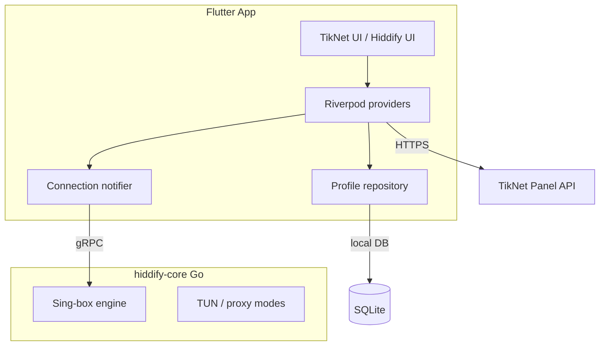

# Architecture

## Overview

TikNet is a Flutter app that wraps **hiddify-core** (Sing-box) via gRPC. User-facing VPN logic lives in `lib/features/`; the Go binary is platform-specific and fetched by `Makefile` / CI (`dependencies.properties` → `core.version`).



## Startup sequence

1. `main.dart` → `lazyBootstrap()` in `bootstrap.dart`
2. Directories, logging, SharedPreferences, profile repo
3. **TikNet only:** diagnostic log file + session reconciliation
4. Desktop: window manager, system tray, auto-start
5. Translations (slang), hiddify-core init
6. `runApp(App())` with GoRouter

TikNet skips Sentry user-interaction wrapper and Hiddify analytics when `tikNetMode` is true.

## Dual-mode design

`lib/core/model/tiknet_config.dart`:

```dart
const bool tikNetMode = true;
const bool tikNetBlocksHiddifyRemote = tikNetMode;
```

When `tikNetMode == true`:

| Area | Behavior |
|------|----------|
| Routing | Login gate + 3 tabs (`lib/core/router/go_router/`) |
| Home | `TikNetConnectionPage` instead of Hiddify home |
| Updates | `TikNetAppUpdateOverlay` (panel APK), not GitHub `UpgradeAlert` |
| Remote URLs | Blocked via `lib/core/hiddify_remote_block.dart` |
| Intro | Auto-completed on first launch |

Hiddify modules (route rules, full settings tree, about, logs) remain in the repo for a possible future toggle but are unreachable in TikNet routing.

## TikNet module (`lib/features/tiknet/`)

| Subfolder | Role |
|-----------|------|
| `login/` | Panel login, QR parser |
| `service/` | API client, config sync, session guard, diagnostic log, outbound apply |
| `model/` | Server catalog, FAQ, personal outbound types |
| `update/` | In-app APK update notifier + overlay |
| `user_info/` | Account tab, diagnostic log page |
| `help/` | FAQ |
| `widgets/` | Shared TikNet UI pieces |

### Panel integration flow

1. Resolve API base URL (GitHub config → panel fallback → cache)
2. `POST /api/customer/login`
3. Fetch subscription config → import as local profile **TikNet**
4. `GET /api/customer/servers` for server picker
5. Optional: `GET /api/customer/app-update` for Android APK updates

Details: [TIKNET.md](../TIKNET.md).

## Connection pipeline

1. User taps connect → `ConnectionNotifier`
2. Active profile config sent to hiddify-core
3. Platform VPN service starts (Android `VpnService`, iOS Network Extension, etc.)
4. TikNet: `applyTikNetPersonalOutboundSelection()` selects urltest/balancer/proxy via core API after connect

## State management

- **Riverpod** + code generation (`@Riverpod`, `.g.dart` files)
- **Drift** for profiles and logs
- **SharedPreferences** for user settings and TikNet session tokens

## Native code notes

Kotlin/Swift still use `com.hiddify.hiddify` package paths from upstream; Android `applicationId` is `com.tik.net`. This is intentional for minimal native diff — see branding table in [DEVELOPMENT.md](DEVELOPMENT.md).

## Generated code

Not committed (see `.gitignore`):

- `**/*.g.dart`, `**/*.freezed.dart`
- `lib/gen/assets.gen.dart`, `lib/gen/translations.g.dart`

Run `make gen` or see [DEVELOPMENT.md](DEVELOPMENT.md).
